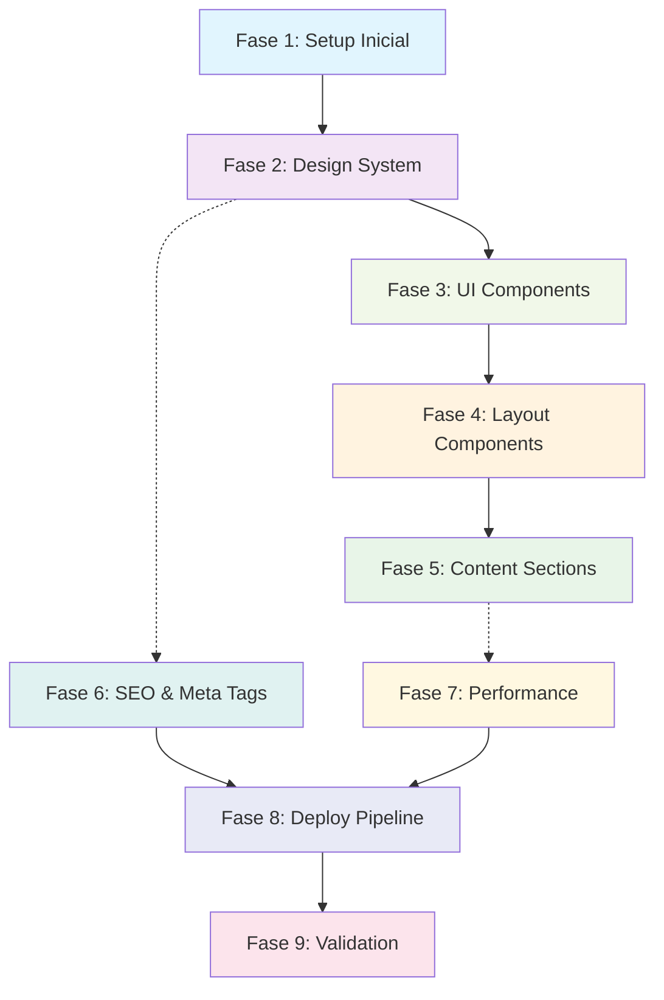

# Plano de Implementação Completo - Redesign Landing Page Maniva Software

**Data:** 13 de setembro de 2026
**Status:** Planejamento concluído
**Tempo total estimado:** 24-30 horas
**Prazo estimado:** 3 dias de trabalho focado

---

## 📋 Visão Geral

Este plano detalha a implementação completa do redesign da landing page Maniva Software conforme especificação detalhada em `docs/2026-09-13-prompt-redesign-maniva-spec.md`.

### Objetivo Final
Criar uma landing page one-page moderna, performante, com autoridade técnica e SEO sólido, hospedada no Cloudflare Pages, implementando o Design System "Mandioca Rizomática". Conteúdo da página, componentes, etc, sempre escrito em Portugues-BR, que é o idioma falado pelo público alvo.

### Stack Técnico
- **Framework**: Vue 3 (última versão)
- **Styling**: Tailwind CSS com design tokens
- **Build**: Vite + vike (SSG/Static Site Generation)
- **Deploy**: Cloudflare Pages via GitHub Actions
- **SEO**: @unhead/vue + structured data JSON-LD
- **Analytics**: GA4 já configurado

---

## 🔄 Sequência de Execução



---

## 📊 Sumário das Fases

### **Fase 1: Setup Inicial e Migração de Stack** ⏱️ 2-3h
**Prioridade:** Alta
**Status:** Pendente
**Arquivo:** `docs/plans/2026-09-13/fase1-setup.md`

**Tarefas principais:**
- Verificar se está na branch main. Caso esteja, criar a branch que incluirá todas as fases do projeto. Essa branch inicia aqui e dará origem ao PR após todas as fases implementadas.
- Ao final de cada fase, commitar na branch da feature, jamais na main.
- Migrar de Vue 3 + Vuetify para Vue 3 + Tailwind + Vite + vike
- Configurar Tailwind CSS e estrutura básica
- Criar estrutura de pastas conforme especificação

---

### **Fase 2: Sistema de Design e Tokens** ⏱️ 4-5h
**Prioridade:** Alta
**Status:** Pendente
**Arquivo:** `docs/plans/2026-09-13/fase2-design-system.md`

**Tarefas principais:**
- Implementar Design System "Mandioca Rizomática"
- Criar tokens de cores, espaçamento, tipografia, efeitos
- Configurar formas orgânicas e integração com Tailwind
- Criar CONTEXT.md com glossário de domínio

---

### **Fase 3: Componentes UI Base** ⏱️ 3-4h
**Prioridade:** Alta
**Status:** Pendente
**Arquivo:** `docs/plans/2026-09-13/fase3-ui-components.md`

**Tarefas principais:**
- Button.vue - "O Broto" (formas assimétricas)
- Card.vue - "Seção Transversal" (textura casca)
- Section.vue - "Solo/Camadas" (clip-path orgânico)
- Typography.vue e Icon.vue
- Foco em acessibilidade WCAG AA

---

### **Fase 4: Layout e Componentes de Estrutura** ⏱️ 2-3h
**Prioridade:** Média
**Status:** Pendente
**Arquivo:** `docs/plans/2026-09-13/fase4-layout-components.md`

**Tarefas principais:**
- Header.vue com navegação segmentada
- Footer.vue com conexões rizomáticas
- Container.vue com grid base 6px
- App.vue principal com estrutura base
- WhatsApp flutuante contextual

---

### **Fase 5: Seções de Conteúdo** ⏱️ 4-5h
**Prioridade:** Média
**Status:** Pendente
**Arquivo:** `docs/plans/2026-09-13/fase5-content-sections.md`

**Tarefas principais:**
- Hero.vue - Above The Fold
- Services.vue - 3 segmentos (pessoas/PMEs, empresas, projetos complexos)
- HelpMed.vue - Showcase com lazy loading
- Methodology.vue - Timeline orgânica
- CTAs contextuais segmentados

---

### **Fase 6: SEO e Meta Tags** ⏱️ 2-3h
**Prioridade:** Média
**Status:** Pendente
**Arquivo:** `docs/plans/2026-09-13/fase6-seo-meta-tags.md`

**Tarefas principais:**
- Configurar @unhead/vue para head management
- Implementar JSON-LD structured data
- FAQ Schema com 8 perguntas/respostas
- GA4 tag já configurado (G-9HV03VP5FL)
- Sitemap e robots.txt estáticos

---

### **Fase 7: Otimização de Performance** ⏱️ 2-3h
**Prioridade:** Média
**Status:** Pendente
**Arquivo:** `docs/plans/2026-09-13/fase7-performance-optimization.md`

**Tarefas principais:**
- Imagens pré-otimizadas (AVIF + WebP)
- Fontes self-hosted via @fontsource
- Lazy loading das seções pesadas
- Configuração GA4 otimizada
- **Sem plugins de compressão** (Cloudflare já faz)

---

### **Fase 8: Deploy e Pipeline CI/CD** ⏱️ 2-3h
**Prioridade:** Alta
**Status:** Pendente
**Arquivo:** `docs/plans/2026-09-13/fase8-deploy-pipeline.md`

**Tarefas principais:**
- GitHub Actions workflow completo
- Lighthouse budgets como gate de merge
- Cloudflare Pages com custom domain
- Deploy automático em PRs (preview)
- Branch protection na `main`

---

### **Fase 9: Validação e Ajustes Finais** ⏱️ 2h
**Prioridade:** Baixa
**Status:** Pendente
**Arquivo:** `docs/plans/2026-09-13/fase9-validation-final.md`

**Tarefas principais:**
- Testes Lighthouse e Core Web Vitals
- Validação SEO e structured data
- Testes de acessibilidade WCAG AA
- Cross-browser e mobile testing
- GA4 validação e smoke tests
- Documentação final CONTEXT.md

---

## 🎯 Pontos Críticos da Spec

### **⚠️ Atenção Especial**
1. **vike** (antigo `vite-plugin-ssr`) - Pacote renomeado
2. **Sem plugins de compressão** - Cloudflare já comprime automaticamente
3. **Sem `vite-plugin-imagemin`** - Descontinuado, assets pré-otimizados
4. **GA4 já configurado** - Apenas inserir tag, usar MCP `analytics-mcp`
5. **Design tokens base 6px** - Mais orgânico que base 8px tradicional
6. **Segmentação por necessidade** - Não por porte empresarial

### **🎨 Design System "Mandioca Rizomática"**
- **Paleta semântica**: Polpa, Raiz, Terra, Folha, Vitalidade
- **Tipografia**: Cormorant Garamond (orgânico) + Figtree (técnico)
- **Formas orgânicas**: clip-path apenas em desktop (>1024px)
- **Progressive enhancement**: mobile clean → desktop expressive

### **🚀 Performance Budgets (Gate de Merge)**
- `LCP ≤ 2500ms`
- `CLS ≤ 0.1`
- `FCP ≤ 1800ms`
- `TBT ≤ 300ms`
- INP monitorado via GA4 (< 200ms meta)

---

## 🔗 Dependências e Sequência

### **Dependências Críticas:**
```
Fase 1 → Fase 2 → Fase 3 → Fase 4 → Fase 5
      ↓           ↓
      Fase 6      Fase 7 → Fase 8 → Fase 9
```

### **Paralelismo Possível:**
- Fase 6 (SEO) pode iniciar após Fase 3
- Fase 7 (Performance) pode iniciar após Fase 5
- Fase 8 (Deploy) depende de todas as anteriores

---

## 📁 Estrutura de Arquivos do Plano

```
docs/plans/2026-09-13/
├── fase1-setup.md               # Setup inicial e migração
├── fase2-design-system.md       # Design System e tokens
├── fase3-ui-components.md       # Componentes UI base
├── fase4-layout-components.md   # Layout e estrutura
├── fase5-content-sections.md    # Seções de conteúdo
├── fase6-seo-meta-tags.md       # SEO e meta tags
├── fase7-performance-optimization.md # Otimização performance
├── fase8-deploy-pipeline.md     # Deploy e CI/CD
├── fase9-validation-final.md    # Validação e ajustes
└── README-PLAN.md               # Este arquivo (sumário)
```

---

## 🎬 Próximos Passos

### **Início da Implementação:**
1. Começar pela **Fase 1: Setup Inicial**
2. Seguir sequência conforme dependências
3. Verificar critérios de aceitação de cada fase
4. Documentar progresso e decisões

### **Verificações Contínuas:**
- Alinhamento com spec original
- Performance dentro dos budgets
- Acessibilidade WCAG AA
- SEO técnicas implementadas

### **Entrega Final:**
- Landing page completamente funcional em produção
- Performance otimizada (Core Web Vitals)
- SEO completo (structured data, meta tags)
- Pipeline CI/CD automatizada
- Documentação CONTEXT.md completa

---

## 📞 Suporte e Recursos

### **Recursos Disponíveis:**
1. **Spec completa**: `docs/2026-09-13-prompt-redesign-maniva-spec.md`
2. **GA4 já configurado**: Measurement ID `G-9HV03VP5FL`
3. **MCP analytics-mcp**: Disponível globalmente no opencode
4. **Cloudflare Pages**: Zona já configurada (Zone ID `035cf7ba96deea38a99797841a04e55d`)
5. **Documentação**: Todos os recursos necessários na spec

### **Contato:**
- WhatsApp: `+55 15 93618-2755`
- Email: contato@manivasoftware.com.br
- LinkedIn: https://www.linkedin.com/company/maniva-software

---

**Nota:** Este plano foi gerado com base na análise detalhada da spec de 88 páginas e organiza o trabalho em tarefas atômicas sequenciais para implementação eficiente e controlada.